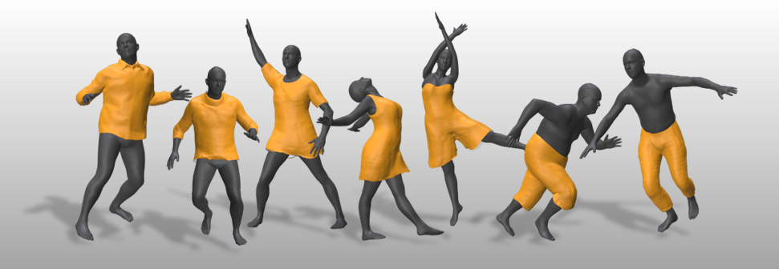
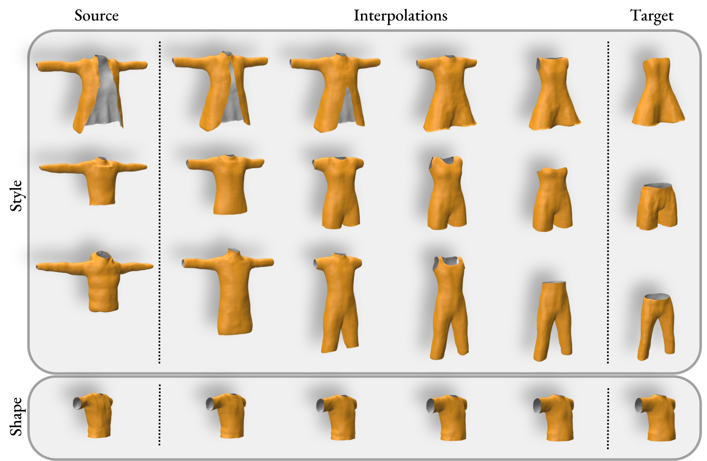

# Design2Cloth: 3D Cloth Generation from 2D Masks
Official Implementation of [**Design2Cloth: 3D Cloth Generation from 2D Masks (CVPR2024)**](https://jiali-zheng.github.io/Design2Cloth/)

<H4 align="center">
Jiali Zheng, Rolandos Alexandros Potamias, Stefanos Zafeiriou
</H4>
<p align="center"> Imperial College London</p>
<p align="center"> Published in the IEEE/CVF Conference on Computer Vision and Pattern Recognition (CVPR 2024)</p>

<p align="center"></p>

## Abstract

In recent years, there has been a significant shift in the field of digital avatar research, towards modeling, animating and reconstructing clothed human representations, as a key step towards creating realistic avatars. However, current methods for 3D cloth generative models are garment specific or trained completely on synthetic data, hence lacking fine details and realism. In this work, we make a step towards automatic realistic garment design and propose Design2Cloth, a high fidelity 3D generative model trained on a real world dataset from more than 2000 subject scans. To provide vital contribution to the fashion industry, we developed a user-friendly adversarial model capable of generating diverse and detailed clothes simply by drawing a 2D cloth mask. Under a series of both qualitative and quantitative experiments, we showcase that Design2Cloth outperforms current state-of-the-art cloth generative models by a large margin. In addition to the generative properties of our network, we showcase that the proposed method can be used to achieve high quality reconstructions from single in-the-wild images and 3D scans.
</br>

## Overview 
**Design2Cloth** is a large-scale style and shape model of cloths. **Design2Cloth** is composed by more than 2000 unique garments worn by 2010 distinct identities with various genders, ages, heights and weights. The model enables modeling and generation of diverse and highly detailed clothes tackling the limitation of previous models to accurately model diverse cloths that follow the real-world distribution.
</br>


<p align="center"></p>


</br>


To create Design2Cloth, we built an automated pipeline to extract cloth meshes from the collected subject scans. We utilized the triplane representation and a dual-resolution discriminator to model various styles and enforce wrinkle details of the generated cloths. The proposed model manages to achieve reconstruction garments with realistic creases.

<p align="center"></p>

</br>

## Public release models
The models have been publicly available for research and education purposes. To obtain access to the models, please download the model from [**here**](https://www.dropbox.com/scl/fi/r0d39u0eru12a3qukh6yv/D2C_ckpt.pt?rlkey=k9g362i5h3yfjc27r7fxs0iun&st=gm9ydwkm&dl=0) and place it under ./ckpt/ for inference.

The models along with their corresponding derivatives are used for non-commercial research and education purposes only.
You agree not copy, sell, trade, or exploit the model for any commercial purposes.
In any published research using the models, you cite the following paper:

Design2Cloth: 3D Cloth Generation from 2D Masks, J. Zheng, RA Potamias and S. Zafeiriou, Proceedings of the IEEE/CVF Conference on Computer Vision and Pattern Recognition (CVPR), June, 2024

## Usage 
The code has been tested on:
* Ubuntu 22.04
* python 3.8.12
* PyTorch 1.12.0 w/ CUDA 11.8.0

Create the required environment by running
```python 
conda env create -f environment.yml
conda activate Design2Cloth
```


#### Inference
We provide inference script and sample data to generate the 3D cloth mesh from a given 2D mask and corresponding shape parameter. Please run the following line for inference.
```python 
python inference.py
```


## Citation 

If you find this work is useful for your research, please consider citing our paper. 

```
@InProceedings{Zheng_2024_CVPR,
    author    = {Zheng, Jiali and Potamias, Rolandos Alexandros and Zafeiriou, Stefanos},
    title     = {Design2Cloth: 3D Cloth Generation from 2D Masks},
    booktitle = {Proceedings of the IEEE/CVF Conference on Computer Vision and Pattern Recognition (CVPR)},
    month     = {June},
    year      = {2024},
    pages     = {1748-1758}
}
```
